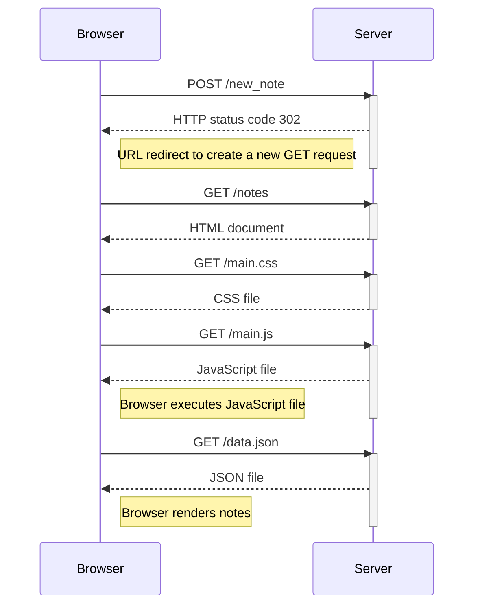

```mermaid
    sequenceDiagram
    Browser->>Server: POST /new_note
    activate Server
    Server-->>Browser: HTTP status code 302
    Note right of Browser: URL redirect to create a new GET request
    deactivate Server

    Browser->>Server: GET /notes
    activate Server
    Server-->>Browser: HTML document
    deactivate Server

    Browser->>Server: GET /main.css
    activate Server
    Server-->>Browser: CSS file
    deactivate Server

    Browser->>Server: GET /main.js
    activate Server
    Server-->>Browser: JavaScript file
    Note right of Browser: Browser executes JavaScript file
    deactivate Server

    Browser->>Server: GET /data.json
    activate Server
    Server-->>Browser: JSON file
    Note right of Browser: Browser renders notes
    deactivate Server
```